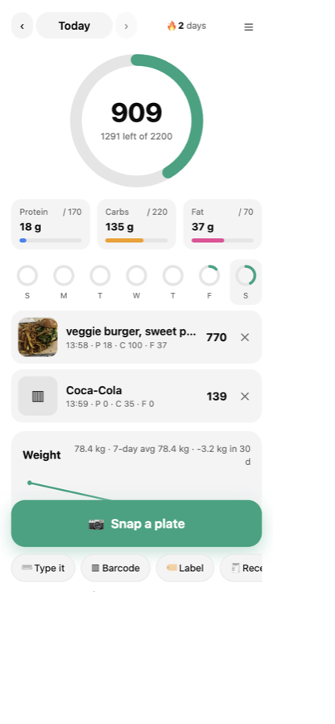

# The food log · `/food`

A photo food log a coach deploys for their clients. Not a chat bot: a page with a
camera button. Snap the plate → the model names the foods and guesses the numbers →
fix the portion with a tap → the day is a ring and three bars. It also reads barcodes,
nutrition labels and receipts, takes weigh-ins, and lets a household share.

It lives inside this Worker. Nothing extra to deploy. **On by default** —
`YourBots/config.js → foodLog.enabled: false` switches it off (`/food` and every
`/api/food/*` route become 404s).

## For the coach: how to deploy it

1. Deploy the bot as usual (`docs/DEPLOY.md`). The food log is already in.
2. Set the pepper — once, before real people use it:
   `npx wrangler secret put FOODLOG_PEPPER` (any long random string; it salts the
   user ids so an email can't be turned into an id from outside). Until it's set the
   log warns and uses a dev value.
3. Put your name in `foodLog.coachName` so the page says "Your coach: …".
4. Send clients to `https://YOUR-BOT-URL/food`. Their phone. That's it.
5. You look at `https://YOUR-BOT-URL/food/coach` with the admin code (the
   `ADMIN_PASSPHRASE`, same one as "Under the hood"): every client, targets, streak,
   last log, 7-day adherence, weight trend, household; click for their week; **Export
   CSV**; link a second device.

## What a client sees

- **First visit:** type an email once. A one-line privacy note. Then targets:
  weight + goal → **Cut / Maintain / Build** fills the numbers, or type your own.
  The preset: maintenance ≈ 33 kcal/kg (the common 15 kcal/lb rule of thumb),
  cut = −500, build = +300; protein 2.0 g/kg (cut) or 1.8 g/kg (in the range the
  Morton 2018 meta-analysis found useful, 1.6–2.2 g/kg); fat 25% of calories;
  carbs the remainder. It's a starting point; the coach adjusts.
- **The day:** a calorie ring, three macro bars, a 7-day strip of small rings,
  streak, the meals with thumbnails (tap to edit, ✕ to delete), yesterday/tomorrow
  arrows, the weight trend when there are weigh-ins.
- **Snap a plate:** the big green button opens the camera. The photo is shrunk in
  the browser to ≤ 1024 px before upload (a 12 MP photo never goes over the wire).
  Back comes the list of foods; **½× 1× 1½× 2×** buttons, a grams field (⚖️),
  **"Wrong food?"** → type "that's chicken, not pork" → it looks again with your
  correction; Save. Under it, always: *Photo estimates are typically within about
  30%. Fix the portion when it's off.*
- **Type it:** "2 eggs and toast" → same list, same buttons.
- **Barcode:** Chrome/Android read the code in the browser (`BarcodeDetector`);
  other browsers send the photo and the model reads the digits. The check digit is
  verified in code, then Open Food Facts (free, no key) gives per-100 g numbers →
  "how much did you have?" — 1 serving, the whole pack, or grams/servings.
  Lookups are cached 90 days in D1. Not in the database → "snap the label instead".
- **Label:** a photo of a nutrition-facts panel → serving size, servings per pack,
  kcal/protein/carbs/fat/fibre/sugar/sodium per serving → same "how much?" step.
  The label is remembered; the same label next time offers "use last time's".
- **Receipt:** a photo → store, date, total, the items. A **Receipts** screen with
  this-week / this-month totals and "+ today" on any item (goes through the
  text estimate). Receipts belong to the household when you're in one.
- **Weigh in:** kg or lb (remembered). A 30-day line and 7-day average on the day
  screen; the coach sees the trend.
- **Household:** create one → a 6-character invite code → your spouse enters it.
  You see each other's days (read-only, with a name), one receipts list, both weight
  trends. Everyone keeps their **own** targets and meals; you cannot edit theirs
  (the server says 403). Leave from the settings screen.

## Identity, in plain English

- Your **email is your log**. The browser makes a random 32-byte **device key**,
  keeps it in localStorage with the email, and sends it with every request. The
  server stores only the SHA-256 of the key. No password. "Remembered forever on
  this browser" — until you clear site data or tap *Forget me*.
- The user id is `SHA-256(lowercased email + FOODLOG_PEPPER)`. Same email → same id.
- **A second browser typing the same email does not get the log.** (Otherwise
  anyone who knew your email could read your meals.) It shows a 6-character code and:
  *"This email is already logging on another device. Sign in with Google to link
  devices, or ask your coach to link them."* The page keeps checking; the moment
  it's linked, it opens.
  - **Coach links it:** `/food/coach` → "Link a second device" → email + code.
    Codes expire after 7 days. Or `POST /api/admin/food/link {email, deviceCode}`.
  - **Sign in with Google / Microsoft / Apple:** proves the email, links the device.
- The device key check **fails closed** (bad key = 401). Features **fail open**
  (no barcode database → a message, the page still works).
- Household reads are checked server-side on every call: `GET /api/food/day?user=X`
  is allowed only when X shares your household. Everything else is yours alone.

## "Sign in with …" (optional)

A provider's own button gives the browser a signed ID token (a JWT). The browser
posts it to `POST /api/food/signin {provider, idToken}` with its device key; the
Worker (`Engine/worker/food-signin.js`) fetches the provider's published public
keys (JWKS, cached an hour), checks the **RS256 signature**, the **issuer**, the
**audience** (= your client id), the **expiry**, and that the email is **verified**.
Only then is the device linked. No client secret, no redirect, no callback route.

Each button appears only when it has a client id — `foodLog.signIn[].clientId`
or the secret `GOOGLE_CLIENT_ID` / `MICROSOFT_CLIENT_ID` / `APPLE_CLIENT_ID`.
No ids = no buttons; the coach code still links devices.

**Google** (free):
1. console.cloud.google.com → create a project (any name).
2. APIs & Services → **OAuth consent screen** → External → app name + support
   email (yours) → no extra scopes → save. Set the publishing status to
   **In production** — the basic `openid email` scopes need no verification. No logo
   (a logo triggers verification).
3. APIs & Services → **Credentials** → Create credentials → **OAuth client ID** →
   Application type **Web application** → **Authorized JavaScript origins** = your
   bot's origin (`https://bot-you-own.you.workers.dev`, and `http://localhost:8798`
   for dev). No redirect URI is needed for the button.
4. Copy the **Client ID** (ends in `.apps.googleusercontent.com`) →
   `npx wrangler secret put GOOGLE_CLIENT_ID`.

**Microsoft** (free): entra.microsoft.com → Identity → Applications → **App
registrations** → New → name it → Supported account types: **Accounts in any
organizational directory and personal Microsoft accounts** → Redirect URI: platform
**Single-page application**, value = your bot origin + `/food/` → Register → copy
the **Application (client) ID** → `npx wrangler secret put MICROSOFT_CLIENT_ID`.

**Apple**: needs the **paid** Apple Developer account ($99/yr). Certificates, IDs &
Profiles → Identifiers → a **Services ID** with Sign in with Apple enabled, your
domain and `https://YOUR-BOT/food/` as the return URL; the Services ID is the
client id → `npx wrangler secret put APPLE_CLIENT_ID`.

Facebook is not included: Facebook Login returns an access token, not an OpenID
ID token, so verifying it needs a Graph API call — a different mechanism.

The verifier is unit-tested without any provider: `node Engine/tests/food-signin.mjs`
signs tokens with a throwaway RSA key against a local fake JWKS and checks that a
good token passes and wrong audience, expired, bad signature, wrong issuer,
unverified email, tampered payload and `alg: none` are all refused (16/16).
**The real buttons have not been clicked in a live deployment** — that needs real
client ids.

## The model — chosen by testing, not by assumption

Five public-domain plates (Wikimedia Commons: carbonara, cheeseburger and fries,
Caesar salad, oatmeal, a pizza slice), the same JSON prompt, every vision model in
the Workers AI catalogue that would take an image, Sept 2026:

| Model | Valid JSON | Foods named | Calories plausible | Time / photo | Verdict |
|---|---|---|---|---|---|
| `@cf/google/gemma-4-26b-a4b-it` (thinking off) | 5/5 | 5/5 — burger **and** fries, carbonara, Caesar salad + dressing, oats, pizza + toppings | 5/5 (burger+fries 1,270; carbonara 580; salad 645; oats 340; pizza 400) | 2–5 s | **chosen** |
| `@cf/meta/llama-3.2-11b-vision-instruct` | 5/5 | 2/5 — missed the burger ("fries, 700 g, 3,500 kcal"), pizza → "cheese, 5 g", salad → "lettuce" | 2/5 | 2–4 s | no |
| `@cf/llava-hf/llava-1.5-7b-hf` | 5/5 after repair (`protein\_g`, carbs as strings) | 4/5 generic ("Pasta", "Salad") | zeros for macros in 3/5 | 5–10 s | no |
| `@cf/qwen/qwen3.8-27b` | 0/5 | — | — | 59 s, ran out of tokens reasoning | no |
| `@cf/moondream/moondream3.1-9B-A2B` | 0/5 | — | — | returned `{}` for every input shape tried (base64 data URI, image_url, task/query, caption) | no |
| Gemma 4 with thinking **on** | 1/5 | — | — | 10–20 s, reasoning ate the token budget | no |

The same model, thinking off, then read a **nutrition label** (the FDA's 2014 sample:
2/3 cup (55 g), 8 servings, 230 kcal, 8 g fat, 37 g carbs, 4 g fibre, 1 g sugar,
3 g protein, 160 mg sodium — every number right), a **real Austrian supermarket
receipt** (Hofer, 2024-03-25, EUR 22.41, 9 items), a **rendered receipt** (8 items,
total 36.12, all correct) and an **EAN-13 barcode** (5449000000996, every digit).

Input shape: OpenAI-style `messages` with an `image_url` data URI (base64). Thinking
is switched off with `chat_template_kwargs: { enable_thinking: false }`.

**Cost** (developers.cloudflare.com/workers-ai/platform/pricing): Gemma 4 is $0.10
per M input and $0.30 per M output tokens. A plate photo was 380–680 tokens and
6–12 neurons in testing — about **$0.0001 a photo**. The free 10,000 neurons a day
cover roughly a thousand photos. `foodLog.dailyPhotoLimit` (default 60 per person)
is the ceiling.

## Privacy

- Photos are read once and **not kept**. The page also makes a ≤ 256 px thumbnail;
  the server checks its size from the image header and stores at most 48 KB of it,
  or nothing. Nothing goes to R2.
- The email is stored (it is the identity). Meals, targets, weights, receipts and
  household membership are stored in D1. Barcode products are cached.
- Delete a meal, a receipt, or leave a household from the page. A coach can look at
  everything; nobody else can.

## What it doesn't do

- It is **not medical advice** and not a substitute for a dietitian. Estimates are
  estimates: a plate photo is typically within about 30%, and the person is told so.
- It doesn't count micronutrients, water, or exercise.
- It doesn't send email. Ever. (Owner's rule for this whole repo.)
- It doesn't sync between browsers by itself — that's the point of the identity
  model; linking is the coach's tap or a sign-in.

## Under the hood

`Engine/worker/food.js` (routes, identity, meals, day/week, coach) ·
`track-vision.js` (the model, prompts, JSON checks, barcode check digit, image
header sizes) · `track-extras.js` (barcodes, labels, receipts, weights,
households) · `track-signin.js` (ID-token verifier) · `track-common.js`.
Tables are in `Engine/schema.sql` (`track_*`), created on first use.
Pages: `Engine/public/food/index.html` (the app) and `coach.html`.
